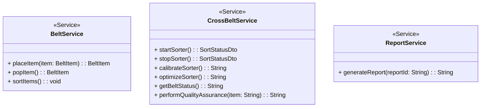

```mermaid
classDiagram
    class BeltService {
        <<Service>>
        + placeItem(item: BeltItem): BeltItem
        + popItem(): BeltItem
        + sortItems(): void
    }

    class CrossBeltService {
        <<Service>>
        + startSorter(): SortStatusDto
        + stopSorter(): SortStatusDto
        + calibrateSorter(): String
        + optimizeSorter(): String
        + getBeltStatus(): String
        + performQualityAssurance(item: String): String
    }

    class ReportService {
        <<Service>>
        + generateReport(reportId: String): String
    }
```